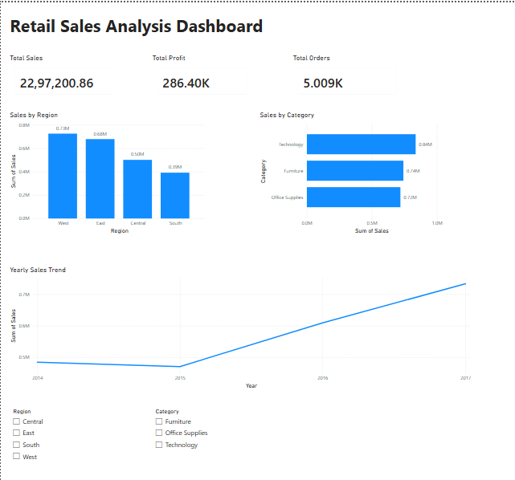

# Retail Sales Analysis Dashboard

## Project Overview
This project analyzes retail sales data using MySQL and Power BI to identify sales trends, regional performance, category-wise sales, and business insights.

## Dashboard Preview

## Tools & Technologies
- MySQL
- SQL
- Power BI
- CSV Dataset
- Data Analysis
- Data Visualization

## Dataset
Sample Superstore Dataset containing sales, profit, customer, product, and regional information.

## Key KPIs
- Total Sales: 22,97,200.86
- Total Profit: 286.40K
- Total Orders: 5,009

## Dashboard Features
- Sales by Region Analysis
- Sales by Category Analysis
- Year-wise Sales Trend
- Interactive Region Filter
- Interactive Category Filter

## Key Insights
- West Region generated the highest sales.
- Technology was the top-performing category.
- Sales showed consistent growth from 2015 to 2017.
- Interactive filters allow dynamic business analysis.

## Project Files
- Retail_Sales_SQL_Project.sql
- Retail_Sales_Dashboard.pbix
- Sample - Superstore.csv
- Dashboard_Screenshot.png

## Skills Demonstrated
SQL, Data Cleaning, Data Analysis, Business Intelligence, Dashboard Development, Power BI, Data Visualization
